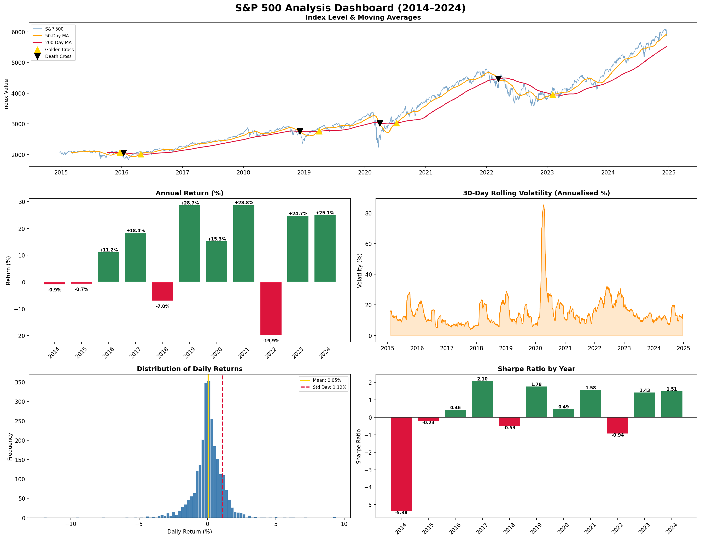

# S&P 500 Market Analysis (2014–2024)

A end-to-end data analysis project exploring 10 years of S&P 500 index data using Python and SQLite.

## Dashboard



## Project Structure
```
sp500_analysis/
├── data/               # Raw CSV dataset
├── queries/            # SQL queries
├── main.py             # Full analysis script
└── README.md
```

## Analysis Performed

- **Year-by-year returns** — annual performance from 2014–2024
- **Moving averages** — 50-day & 200-day MAs with Golden/Death Cross signals
- **Volatility** — 30-day rolling volatility highlighting market turbulence
- **Return distribution** — histogram of daily returns across the decade
- **Sharpe Ratio** — risk-adjusted returns overall (~X.XX) and by year

## Key Findings

- The worst single day was [DATE] during the COVID crash (-X.X%)
- 2022 was the worst year (Fed rate hikes) with a return of -XX%
- 2019 and 2023 were standout years with strong risk-adjusted returns
- Overall 10-year Sharpe Ratio: X.XX

## Tech Stack

- **Python** — pandas, matplotlib, seaborn
- **SQLite** — aggregations and filtering via sqlite3
- **Data** — S&P 500 daily index from Kaggle (2014–2024)
